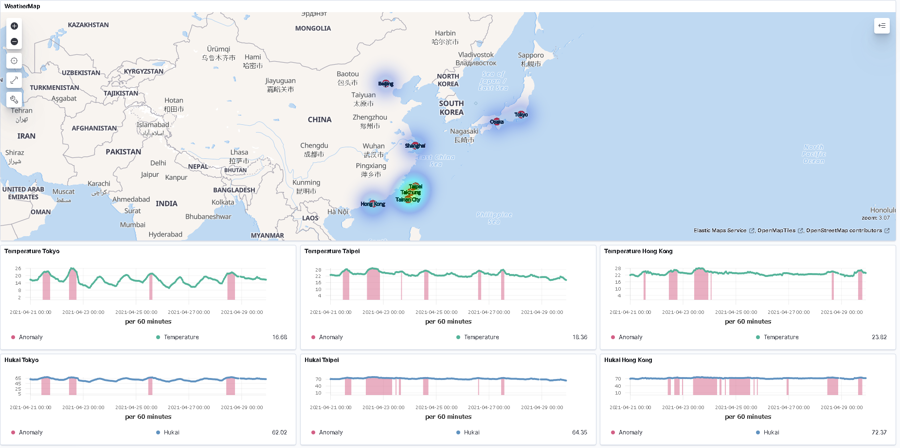
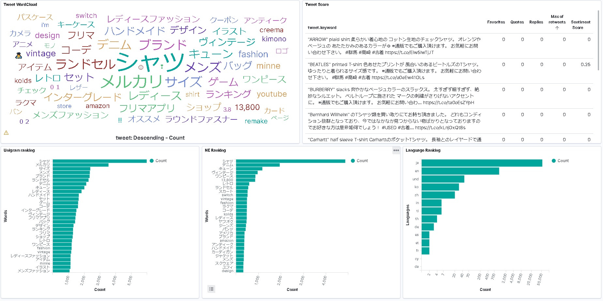

# Weather-Text-Collector-API
### FASTAPI based general-purpose API server
#### Weather API
* calculate **GEOHASH** from latitude & longitude
* calculate **HUKAI** coefficient from temperature & humidity
* calculate **KANSO** coefficient from humidity
* detect anomalies from weather information based on **Anomaly-Detection** models
#### NLP API
* extract **Named Entities** from collected tweets
* calculate **Sentiment Analysis** score from colllected tweets

#### Visualization
##### Weather Anomaly Detection

##### Text Analysis

